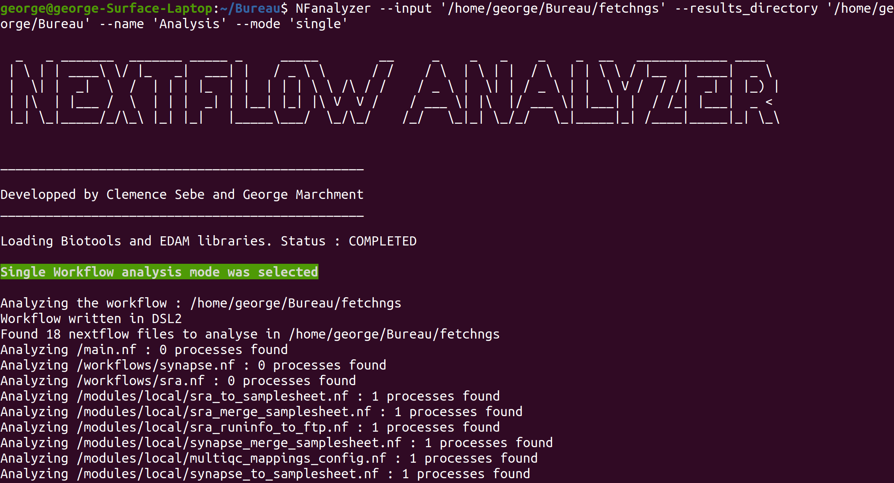

[](https://github.com/IFB-ElixirFr/fair-checker/actions) [](LICENSE) []()


# AnalyseDonneesNextflow

In this repository are presented variations of a Github crawler, adapted to search for Nextflow and Snakemake workflows. 

In the context of research, the need to form a database to be able to compare several workflows led to the development of the crawler.

These Jupyter notebooks showcase how GitHub can be crawled to assemble a corpus of scientific workflows written in various languages.

Main contributors are: 
- [Alban Gaignard](https://github.com/albangaignard)
- [George Marchment](https://github.com/George-Marchment)
 

## Main features

The GitHub Search API has a custom rate limit. User-to-server requests are limited to 5,000 requests per hour and per authenticated user. 

There are 3 different versions of the crawler.
 

- The first 2 versions 'crawler_one_at_a_time' and 'Bioinformatics workflows crawler' work as such : after each request the crawler waits a period of time as so not to surpass the 5,000 requests per hour rate limit. 

    The GitHub Search API provides up to 1,000 results for each search. This causes a problem when wanting to form a large database (of workflows here). To overcome this limitation, the global request : ‘retrieve files written in Snakemake or Nextflow’, is divided into multiple requests :  ‘retrieve files written in Snakemake or Nextflow during *x* month and year’. The month and year are incremented and the request is repeated. This is what differentiate these 2 versions : 
  1. 'crawler_one_at_a_time' repeats the request during different time periods as to maximise the results. 
  2. 'Bioinformatics workflows crawler' does not.


* In the third version of the crawler ‘crawler_all_at_once’, the 5,000 requests are done linearly and are not limited by the time, however after the 5,000 requests the crawler waits an hour. In the same way as 'crawler_one_at_a_time', it repeats the request during different time periods as to maximise the results.

All versions of the crawler are functional.

While the crawler is running, the data is saved in a json file.

## Known bugs

  - None

## Contribute
Please submit GitHub issues to provide feedback or ask for new features, and contact us for any related question.


## Install and Run

### To install :
```
sudo python3 setup.py install
```

### To run :

See [here](Docs/Examples%20Nextflow%20Analyzer.pdf) for a more explicit explanation on how to run the analyzer

#### __Single mode (DSL1 workflow) :__

When analyzing a single DSL1 workflow, the analyzer needs as input the address of the main of the workflow.

```
NFanalyzer --input 'address/to_folder/to_workflow.nf' --results_directory 'address/to_save' --name 'New_Analysis' --mode 'single'
```


#### __Single mode (DSL2 workflow) :__

When analyzing a single DSL2 workflow, the analyzer needs as input the address of a folder containing the nextflow files of the workflow.

```
NFanalyzer --input 'address/to_folder/to_workflow' --results_directory 'address/to_save' --name 'New_Analysis' --mode 'single'
```


#### __Multi mode :__

When analyzing a multiple workflows, the analyzer needs as input the address of a folder containing the all the workflows wanting to be analyzed.

```
NFanalyzer --input 'address/to_folder/to_workflows' --results_directory 'address/to_save' --name 'New_Analysis' --mode 'multi'
```


### Requirements 

Your software environment needs the following Python packages : 

- setuptools
- argparse
- pathlib
- os
- glob2
- re
- graphviz
- json
- rdflib
- jellyfish
- glob
- threading
- queue
- time
- sys
- functools
- ntpath 

## License
FAIR-Checker is released under the [MIT License](LICENSE). Some third-party components are included. They are subject to their own licenses. All of the license information can be found in the included [LICENSE](LICENSE) file.

## Funding
#TODO
